# KPYRIOS-ACPIA

## Agentic Child Protection Investigation Assistant
**Kerala Police CyberDome — HACKP 2026**

Transforming fragmented digital evidence into explainable, actionable investigation intelligence while maintaining sovereign human accountability.

---

## 1. Problem

### The Investigation Intelligence Bottleneck

Modern digital forensics in child protection (CSAE/CSAM) investigations face an unprecedented **evidence overload**. Investigators are routinely inundated with gigabytes of heterogeneous digital artifacts:

* **Multi-device extractions:** Mobile phones, laptops, removable media.
* **Communication logs:** Telegram channels, Discord servers, WhatsApp exports, encrypted mail.
* **Forensic media:** Images, videos, screen captures, audio notes.
* **Cryptographic & network telemetry:** IP session logs, Wi-Fi authentication dumps, crypto-wallet transactions.
* **Geospatial & temporal metadata:** EXIF geotags, cell-tower records, check-ins.

```
┌─────────────────┐     ┌─────────────────────┐     ┌──────────────────────┐     ┌───────────────────────┐
│ Evidence Volume │ ──▶ │ Data Fragmentation  │ ──▶ │  Cognitive Overload  │ ──▶ │ Prioritization Crisis │
│ Thousands of    │     │ Disconnected Silos  │     │ Manual Correlation   │     │ "What should I        │
│ forensic files  │     │ & Multi-Format Data │     │ Consumes Days/Weeks  │     │ investigate next?"    │
└─────────────────┘     └─────────────────────┘     └──────────────────────┘     └───────────────────────┘
```

**The fundamental bottleneck is not the inability to extract data—it is turning voluminous, scattered data into clear investigative direction.** Critical relationships remain obscured across silos, time-sensitive victim-protection leads decay, and investigators risk confirmation bias during manual triage.

---

## 2. Solution

### KPYRIOS as an Agentic Investigation Intelligence Layer

**KPYRIOS-ACPIA** introduces an intelligent analytical co-pilot built specifically for law enforcement child protection units. 

Unlike traditional passive query tools or generic conversational chatbots, KPYRIOS operates as a **goal-driven, state-aware agentic partner**:

* **Process-Centric, Not Conversational:** Investigations require structured hypotheses, verifiable provenance, and disciplined multi-step workflows—not open-ended chatting.
* **Cross-Silo Evidence Correlation:** Ingests and links multi-modal artifacts into an unified **NetworkX Multi-Directed Evidence Graph**.
* **Contradiction & Coverage Gap Detection:** Automatically detects spatiotemporal conflicts (e.g., impossible travel times across GPS/Wi-Fi logs) and missing investigative vectors.
* **Uncertainty Reduction via Expected Information Gain (EIG):** Mathematically ranks candidate investigative steps so officers focus on the actions that eliminate the greatest investigative uncertainty.
* **Sovereign Human Governance:** Strict three-tier authorization guards prevent autonomous overreach.

---

## 3. Core Innovation

KPYRIOS implements three mathematically grounded, project-defined innovations unified within a single investigation loop:

### 1. Structural Evidence Dependency (Leave-One-Out Ablation)
Instead of displaying an opaque "AI confidence score," KPYRIOS measures how heavily any hypothesis relies on specific evidence items. By performing deterministic leave-one-out graph ablation, the system measures the exact drop in hypothesis belief when an artifact is removed, expressed strictly in **percentage points (`pp`)**:

$$\Delta \text{Belief}(H \mid -e_i) = \text{Belief}(H) - \text{Belief}(H \setminus \{e_i\})$$

This immediately alerts investigators if an entire theory of the case hangs on a single uncorroborated or potentially compromised artifact.

### 2. Expected Information Gain (EIG)
To answer *"What should I investigate next?"*, the Strategy Agent evaluates all candidate investigative actions (e.g., ISP subscriber requests, EXIF cross-referencing, device image carving) against active competing hypotheses ($H_1, H_2, \dots, H_n$), computing the expected reduction in Shannon entropy:

$$\text{EIG}(a) = \mathcal{H}(P) - \sum_{o \in \mathcal{O}(a)} P(o \mid a) \cdot \mathcal{H}(P_{a=o})$$

*(Reported in bits as an interpretable PoC approximation to rank actions by investigative value).*

### 3. Agentic Replanning
When an investigative action fails, returns corrupted data, or yields unexpected findings, the Investigation Agent's ReAct cycle does not halt blindly. It observes the failure, updates the shared state, triggers contradiction/gap analysis, and replans an alternate investigative pathway.

---

## 4. Key Architectural Principle

### Two Agents. One Shared Investigation State.

To prevent erratic emergent behavior and maintain judicial explainability, the architecture is **strictly restricted to two specialized agents** operating over a single versioned state container:

```
┌─────────────────────────────────────────────────────────────────────────────────┐
│                                 INVESTIGATOR UI                                 │
│        (React 18 + TypeScript + 3D WebGL Evidence Graph + Forensic Tokens)       │
└────────────────────────────────────────┬────────────────────────────────────────┘
                                         │
                                         ▼
┌─────────────────────────────────────────────────────────────────────────────────┐
│                            HUMAN AUTHORIZATION GATE                             │
│                  [ AUTO (Tier 1) | REVIEW (Tier 2) | ONLY (Tier 3) ]            │
└───────────────────┬─────────────────────────────────────────▲───────────────────┘
                    │                                         │
       ┌────────────┴────────────┐               ┌────────────┴────────────┐
       │   INVESTIGATION AGENT   │ ◀───────────▶ │     STRATEGY AGENT      │
       │        (Agent 1)        │  Shared State │        (Agent 2)        │
       │   ReAct Execution Loop  │               │      EIG Optimizer      │
       └────────────┬────────────┘               └────────────▲────────────┘
                    │                                         │
                    ▼                                         │
┌─────────────────────────────────────────────────────────────┴───────────────────┐
│                    SHARED INVESTIGATION STATE CONTAINER                         │
│   • Active Hypotheses    • Immutable Evidence Catalog   • Contradiction Matrix  │
│   • Coverage Gaps        • Candidate Action Ledger      • Cryptographic Trace   │
└───────────────────┬─────────────────────────────────────────────────────────────┘
                    │
                    ▼
┌─────────────────────────────────────────────────────────────────────────────────┐
│                     DETERMINISTIC TOOL & REASONING LAYER                        │
│   • SHA-256 Hasher      • Metadata / EXIF Extractor   • Tesseract OCR Engine    │
│   • spaCy NLP Parser    • Entity Resolution Engine    • NetworkX Graph Engine   │
│   • Contradiction Engine• Dependency Engine (pp)      • EIG Math Calculator     │
└───────────────────┬─────────────────────────────────────────────────────────────┘
                    │
                    ▼
┌─────────────────────────────────────────────────────────────────────────────────┐
│                  IMMUTABLE RAW EVIDENCE & POSTGRESQL LEDGER                     │
│   • SHA-256 Hashed Artifacts  • Structural Provenance Schema  • Audit Log       │
└─────────────────────────────────────────────────────────────────────────────────┘
```

1. **Investigation Agent (`Agent 1`):** Executes the investigation loop (`Observe` $\rightarrow$ `Understand` $\rightarrow$ `Plan` $\rightarrow$ `Select Tool` $\rightarrow$ `Execute` $\rightarrow$ `Observe Result` $\rightarrow$ `Update State` $\rightarrow$ `Replan`).
2. **Strategy Agent (`Agent 2`):** Reads graph state, assesses gaps and contradictions, computes EIG across candidate actions, and generates human-readable strategic rationales.
3. **Deterministic Engines (Non-Agentic):** All hashing, parsing, entity extraction, graph traversal, and mathematical scoring are pure deterministic Python code—never probabilistic sub-agents.

---

## 5. System Architecture

The complete system architecture guarantees security, data integrity, and strict legal compliance at every boundary.

### Final Architecture Overview
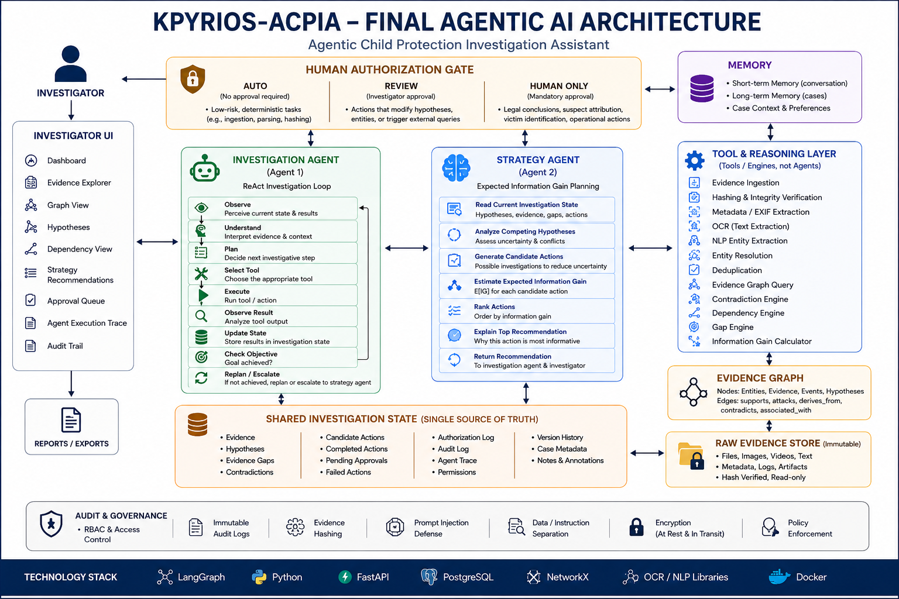
*Figure 1: Final KPYRIOS-ACPIA Agentic AI Architecture showing Investigator UI, Dual-Agent Core, Three-Tier Authorization Gate, Tool Ecosystem, and Immutable Storage.*

### Agents & Investigation Flow
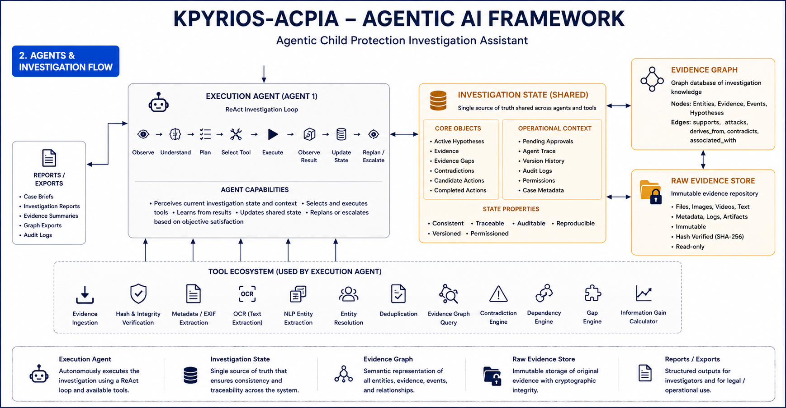
*Figure 2: ReAct Investigation Loop, Shared State transitions, and Deterministic Tool Ecosystem.*

### Data, State & Governance Architecture
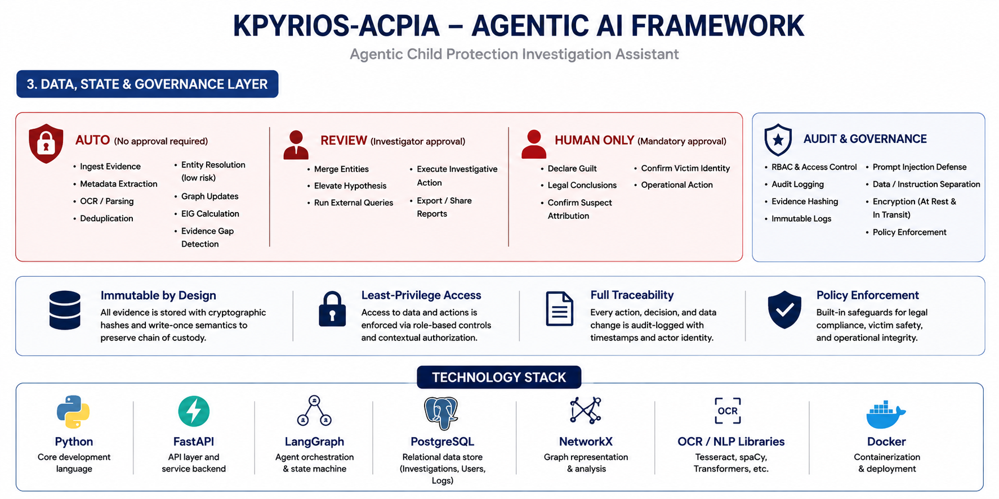
*Figure 3: Three-Tier Authorization specifications, cryptographic audit ledger, and security controls.*

### Core Orchestration Exploration
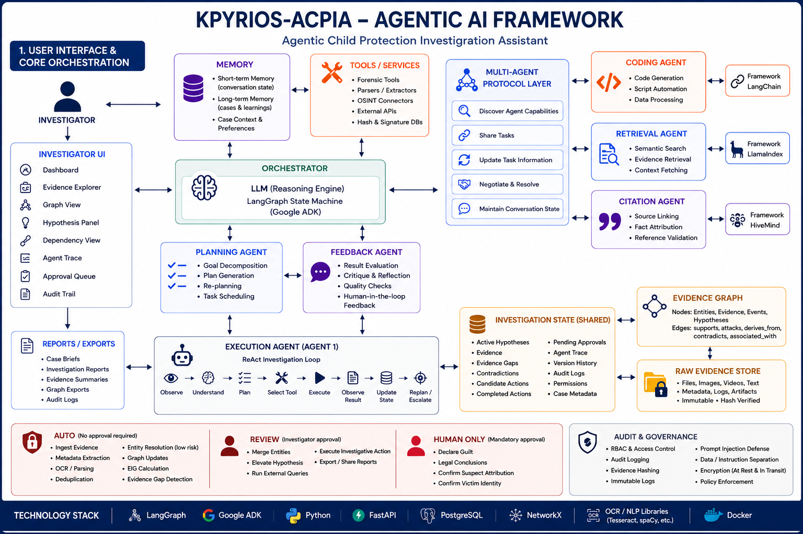
*Figure 4: Initial component orchestration exploration created during the preliminary architectural design phase.*

---

## 6. Investigation Workflow

```
[Raw Evidence Ingestion]
         │
         ▼
[SHA-256 Integrity Verification & Immutable Storage]
         │
         ▼
[Deterministic Extraction: Metadata, EXIF, OCR, NLP Parsing]
         │
         ▼
[Entity Resolution & Candidate Merge Identification]
         │
         ▼
[NetworkX Evidence Graph Construction (Nodes, Edges, Provenance)]
         │
         ▼
[Hypothesis Formulation & Contradiction/Gap Detection]
         │
         ▼
[Strategy Agent: Candidate Action Generation & EIG Calculation]
         │
         ▼
[Three-Tier Authorization Gate]
  ├── AUTO    ──▶ [Instant Deterministic Execution]
  ├── REVIEW  ──▶ [Execution Halts: Requires Signed Human Approval]
  └── ONLY    ──▶ [BLOCKED: Legal & Moral Actions Prohibited to AI]
         │
         ▼
[Investigation Agent: Tool Execution & State Update]
         │
         ▼
[Dynamic Replanning on Tool Failure / New Evidence]
         │
         ▼
[Cryptographically Sealed Audit Ledger & Court-Ready Case Brief Export]
```

---

## 7. Human Authorization Model

KPYRIOS enforces a non-bypassable **Three-Tier Authorization Boundary** directly in the software dispatcher:

| Tier | Name | Execution Model | Permitted Actions |
|---|---|---|---|
| **Tier 1** | `AUTO` | Autonomous inline execution | Evidence ingestion, SHA-256 hashing, EXIF/OCR extraction, graph queries, belief propagation, EIG calculation. |
| **Tier 2** | `REVIEW` | **Execution halts.** Requires explicit investigator/supervisor API sign-off | Entity merges (`@alias` $\leftrightarrow$ Person), elevating hypothesis status, issuing external queries, generating official export reports. |
| **Tier 3** | `ONLY` | **Prohibited from AI.** Raises `HumanOnlyActionError` | Declaring guilt, confirming victim identity, legal suspect attribution, issuing criminal charges. (Zero executable code). |

> **Ethical Boundary:** KPYRIOS-ACPIA is an intelligence assistance tool. It never decides guilt, never attributes legal culpability, and never automates moral or judicial decisions.

---

## 8. Security & Evidence Integrity

### Implemented Controls
* **SHA-256 Cryptographic Fingerprinting:** Computed immediately upon ingestion; raw files are stored in write-once immutable storage (`data/storage/`).
* **Structural Provenance Enforcement:** Every `Fact`, `Relationship`, and `Hypothesis` database record strictly enforces a non-empty `source_ids: list[UUID]` foreign-key array linking directly to verified raw evidence.
* **Role-Based Access Control (RBAC):** Three discrete roles (`Investigator`, `Supervisor`, `Auditor`) enforced via signed JWT bearer tokens and password hashing (`bcrypt`).
* **Cryptographic Audit Ledger:** Every agent observation, tool execution, user login, and human review decision is recorded in an append-only, tamper-evident log.
* **Prompt-Injection Defense:** Untrusted evidence text is treated strictly as data (validated Pydantic JSON), never as system instructions.
* **Bounded LLM Architecture:** External LLM calls (Claude API) are restricted strictly to narrative summarization; graph algorithms, permissions, and EIG math are purely deterministic.

### Planned Production Hardening
* **Hardware Security Module (HSM) Signing:** Integration with PKI-based HSM for cryptographically signing court-ready export briefs.
* **Hardware WORM Storage:** S3 Object Lock / WORM compliance appliances for physical tamper-proofing in state police forensic labs.
* **Full Data-at-Rest Encryption:** AES-256 encryption for database columns containing sensitive minor-protection evidence metadata.

---

## 9. Technology Stack

| Layer | Component / Library | Implementation Status | Purpose |
|---|---|---|---|
| **Frontend** | React 18 + Vite + TypeScript | Implemented | High-performance interactive forensic UI |
| **Frontend 3D/2D** | Three.js / React Three Fiber | Implemented | Interactive 3D spatial evidence graph with 2D fallback |
| **Frontend Styling** | Vanilla Forensic CSS Tokens | Implemented | Navy/Charcoal CyberDome visual design system |
| **Backend Framework** | Python 3.12 + FastAPI | Implemented | Asynchronous REST API service layer |
| **Data Validation** | Pydantic v2 + Pydantic Settings | Implemented | Strict schema enforcement and injection defense |
| **Database & ORM** | SQLAlchemy 2.0 + Alembic | Implemented | Relational state, audit logs, and provenance mapping |
| **Database Engine** | SQLite (Dev/Test) / PostgreSQL (Prod) | Implemented | ACID persistence with async connection drivers |
| **Graph Mathematics** | NetworkX | Implemented | Deterministic graph traversal, shortest paths, centrality |
| **Agent State Machine** | LangGraph / State Container | Implemented | Dual-agent ReAct and EIG execution runtime |
| **Forensic Extraction** | Tesseract OCR + spaCy | Configured / Bounded | Deterministic optical text and entity extraction |
| **LLM Reasoning** | Claude API (Anthropic) | Bounded | Narrative case brief generation and summarization only |
| **Containerization** | Docker + Docker Compose + Nginx | Implemented | Multi-stage production deployment configuration |

---

## 10. Repository Structure

```text
kpyrios-acpia/
├── backend/                      # FastAPI Python Application Core
│   ├── alembic/                  # Database migration scripts
│   ├── app/
│   │   ├── agents/               # Dual-agent runtime (investigation_agent, strategy_agent)
│   │   │   ├── engines/          # Deterministic engines (EIG, dependency, contradiction, graph)
│   │   │   ├── llm/              # Bounded LLM client wrappers
│   │   │   ├── tools/            # Deterministic forensic tools (ingest, hash, ocr, nlp)
│   │   │   ├── authorization.py  # Three-tier authorization gate enforcement
│   │   │   └── state.py          # InvestigationState container
│   │   ├── api/                  # REST API route handlers (/auth, /cases, /evidence, /actions)
│   │   ├── core/                 # Config, security (JWT/bcrypt), database, structured logging
│   │   ├── middleware/           # RBAC guards & structured request auditing
│   │   ├── models/               # SQLAlchemy ORM models (User, Case, Evidence, Fact, Audit)
│   │   ├── schemas/              # Pydantic v2 data validation schemas
│   │   ├── scripts/              # Seed scripts (seed_demo_case.py)
│   │   └── main.py               # FastAPI application entrypoint
│   ├── tests/                    # Unit, integration, and security test suites
│   ├── pyproject.toml            # Poetry / Python build configuration
│   └── requirements.txt          # Python dependency specifications
├── frontend/                     # React 18 TypeScript Single-Page Application
│   ├── src/
│   │   ├── components/           # Navbar, Sidebar, ProtectedRoute, ShellLayout
│   │   ├── contexts/             # AuthContext (JWT state, roles, permissions)
│   │   ├── design-system/        # Navy/Charcoal forensic tokens, Buttons, Badges, Modals
│   │   ├── features/             # 3D/2D Evidence Graph, Timeline, Dependency Ablation
│   │   ├── pages/                # Dashboard, Evidence, Hypotheses, Strategy, Approvals, Reports
│   │   ├── services/             # Axios API client & typed endpoints
│   │   ├── types/                # TypeScript data models
│   │   ├── App.tsx               # Main application routing and route guards
│   │   └── main.tsx              # React DOM mounting
│   ├── package.json              # Node.js dependencies and scripts
│   └── vite.config.ts            # Vite compiler configuration
├── data/                         # Forensic Evidence Data & Synthetic Test Fixtures
│   ├── storage/                  # Immutable raw evidence storage (write-once)
│   └── synthetic_cases/          # Synthetic child protection demonstration fixtures
│       └── case_KP-ACPIA-001/    # "Operation CyberShield" synthetic test case
├── docker/                       # Containerization configurations
│   ├── backend.Dockerfile        # Python 3.12 slim backend image
│   ├── frontend.Dockerfile       # Node 22 + Nginx Alpine multi-stage frontend image
│   └── nginx.conf                # Nginx reverse proxy configuration
├── docs/                         # Repository Documentation & Presentation Assets
│   ├── architecture/             # Architectural diagrams (PNG)
│   │   ├── arch-01-agentic-framework.png
│   │   ├── arch-02-data-state-governance.png
│   │   ├── arch-03-ui-orchestration.png
│   │   └── arch-04-complete-architecture.png
│   ├── presentation/             # 15 Official Presentation Slides (PNG)
│   │   ├── 01-title.png ... 15-validation-impact-roadmap.png
│   │   └── README.md
│   ├── references/               # Reference evaluations and compliance index
│   │   └── README.md
│   ├── technical/                # Formal Technical Project Document (PDF)
│   │   └── KPYRIOS-ACPIA_Technical_Project_Document.pdf
│   ├── API.md                    # REST API endpoint reference
│   ├── ARCHITECTURE.md           # System architecture blueprint & invariants
│   ├── ARCHITECTURE_FINAL.md     # Final consolidated architecture specification
│   ├── DEMO_SCRIPT.md            # 5-minute evaluator demonstration walkthrough
│   ├── DEPLOYMENT.md             # Docker & VM deployment guide
│   ├── LICENSES.md               # Third-party license audit & compliance
│   ├── REPO_ANALYSIS.md          # 10 reference repository evaluations & reuse decisions
│   └── UI_REFERENCE_NOTES.md     # Visual design system & UX notes
├── docker-compose.yml            # Local Docker Compose orchestrator
├── docker-compose.prod.yml       # Production-hardened Compose configuration
├── .env.example                  # Environment configuration template
└── README.md                     # Project master documentation
```

---

## 11. Presentation

The complete 15-slide presentation deck prepared for the Kerala Police CyberDome evaluation committee:

### Slide 01 — Title & Executive Mission
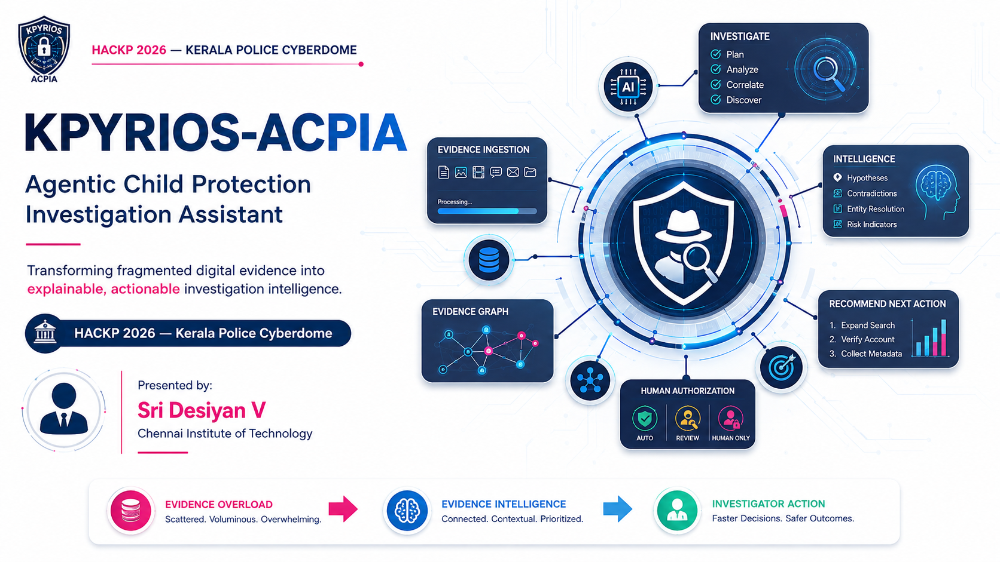

### Slide 02 — The Problem: Evidence Overload
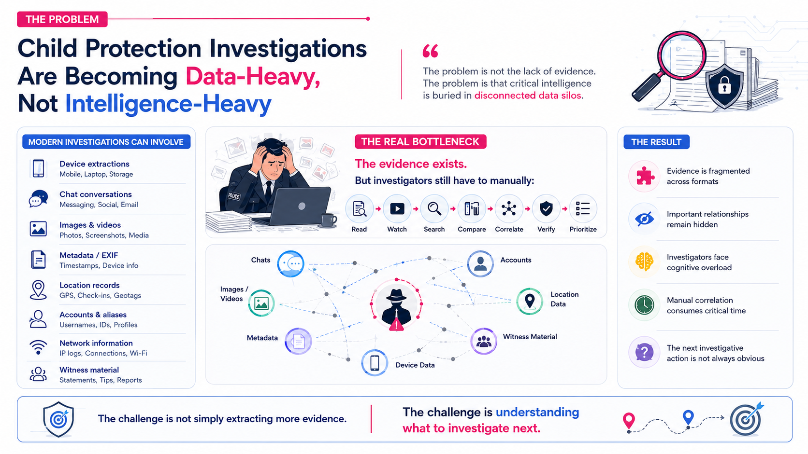

### Slide 03 — The Investigation Bottleneck
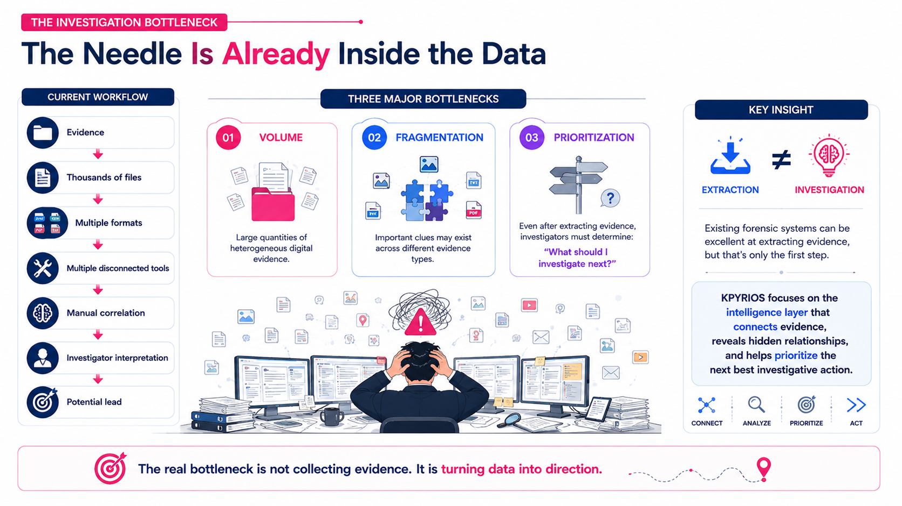

### Slide 04 — Why a Chatbot Is Not Enough
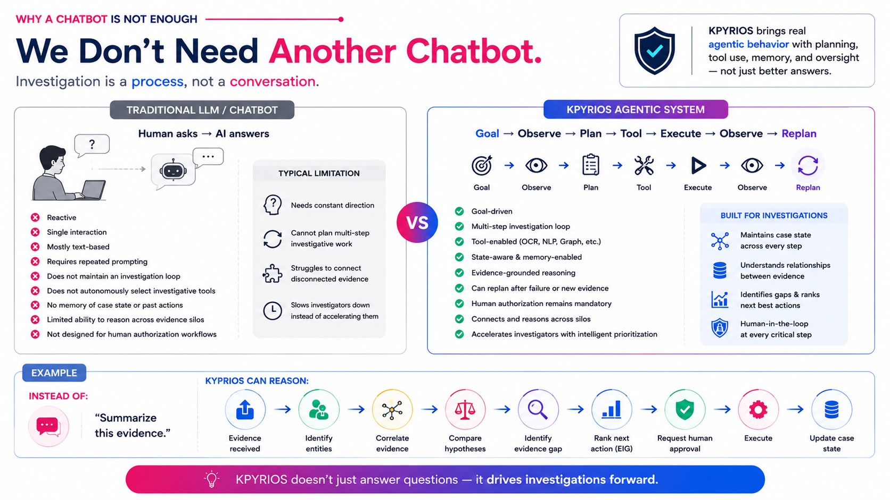

### Slide 05 — Existing Landscape & Capability Gap
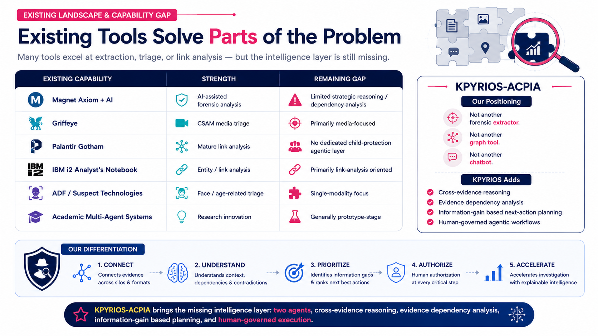

### Slide 06 — The Core Innovation: Three Innovations, One Loop
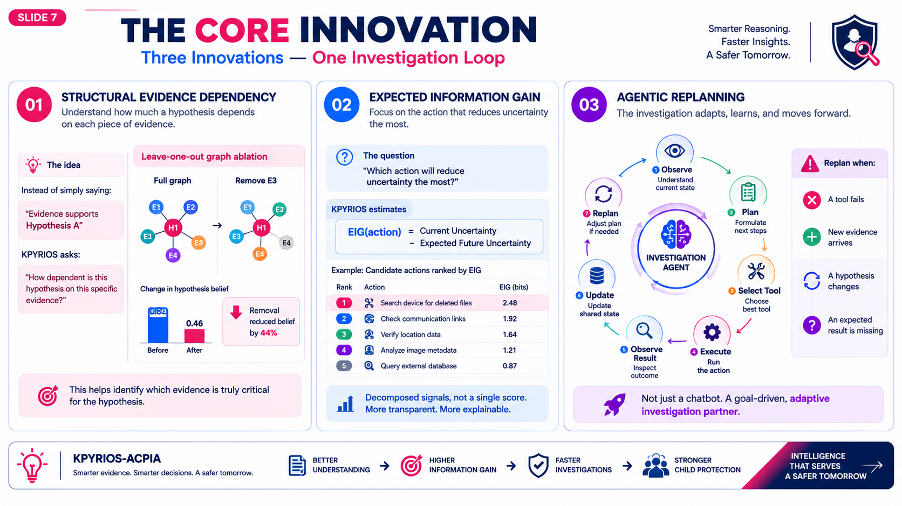

### Slide 07 — System Architecture: Two Agents, One State
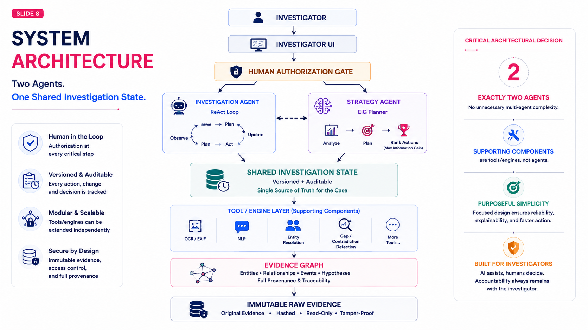

### Slide 08 — The Two Agents: Investigation Agent + Strategy Agent
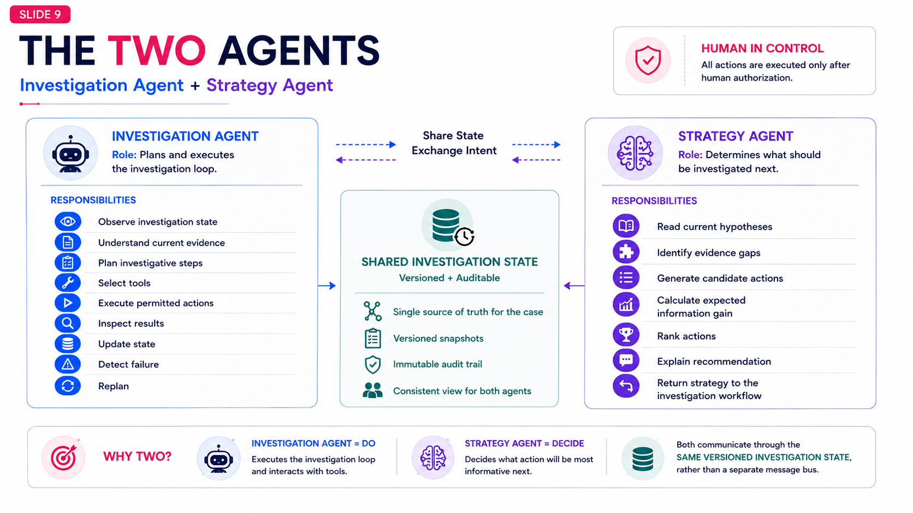

### Slide 09 — Evidence Intelligence Pipeline: Raw to Trusted
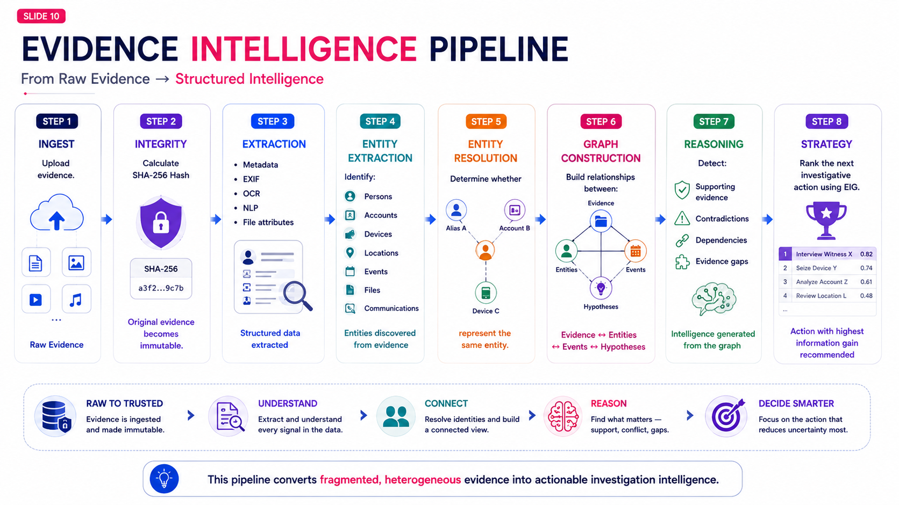

### Slide 10 — Detailed Ingestion & Graph Construction


### Slide 11 — Evidence Graph + Expected Information Gain (EIG)
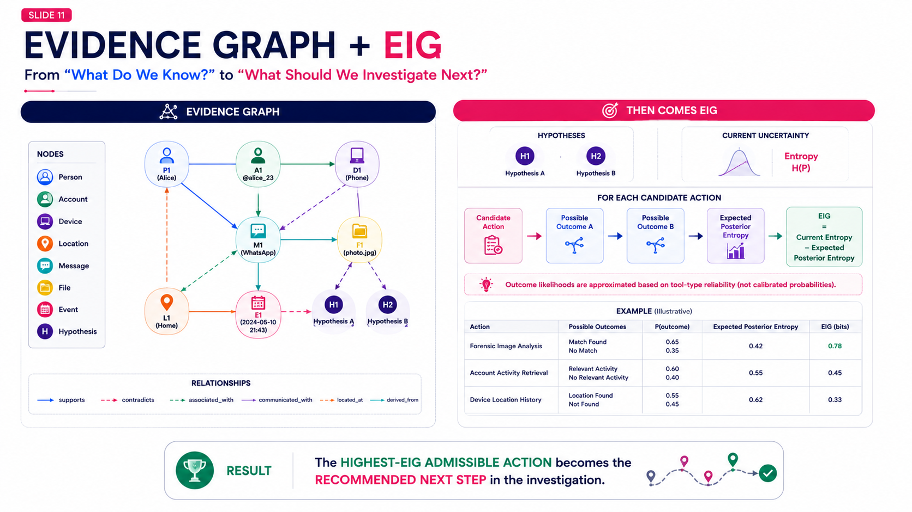

### Slide 12 — Human-in-the-Loop & Three-Tier Authorization
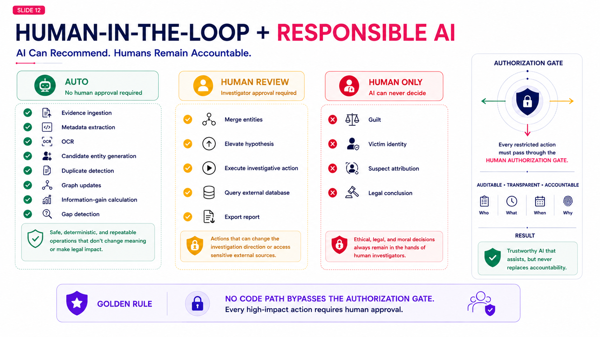

### Slide 13 — Security & Evidence Integrity
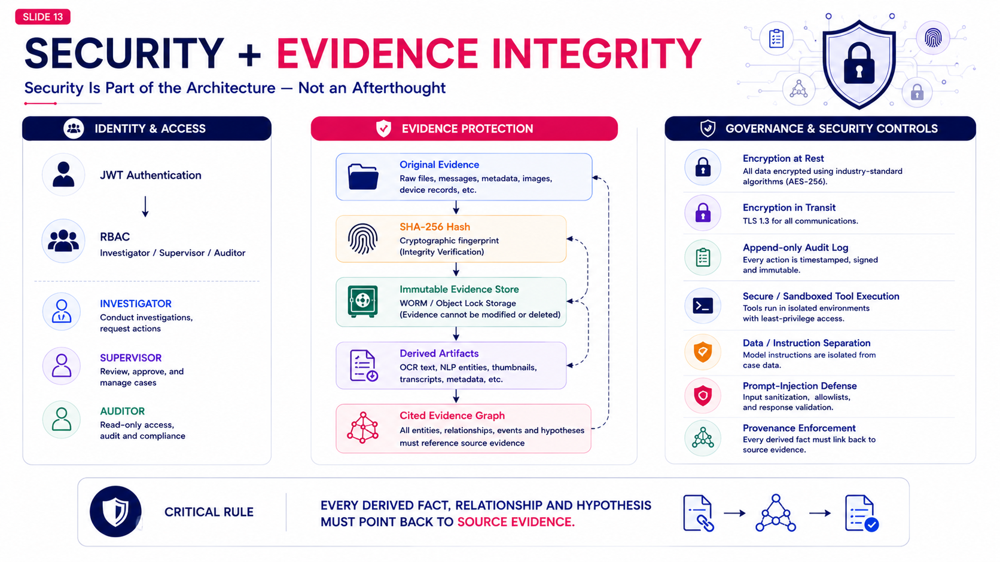

### Slide 14 — End-to-End Demonstration & Tech Stack
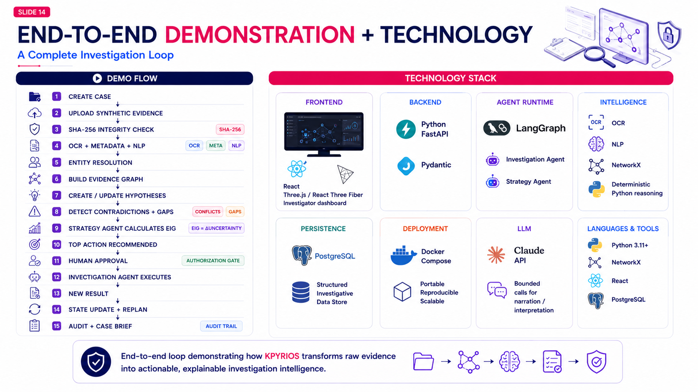

### Slide 15 — Validation, Impact & Roadmap
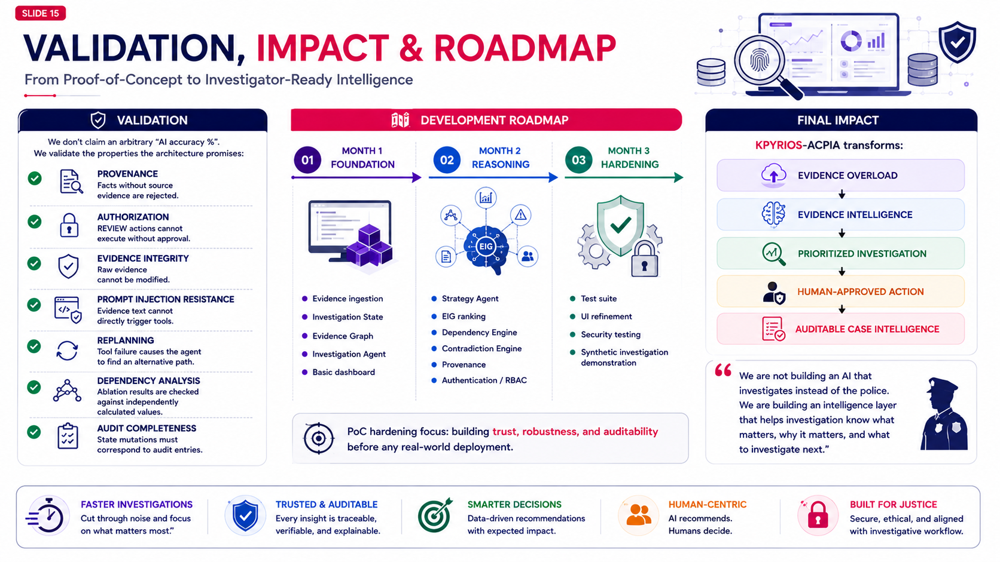

---

## 12. Technical Documentation

All technical documentation artifacts are organized within the [`docs/`](docs/) directory:

1. **[Technical Project Document (PDF)](docs/technical/KPYRIOS-ACPIA_Technical_Project_Document.pdf)**: Complete 34-page system specification, mathematical formulations, and legal compliance analysis.
2. **[Final Consolidated Architecture](docs/ARCHITECTURE_FINAL.md)**: Verified 10-point architectural invariant checklist.
3. **[Architecture Blueprint](docs/ARCHITECTURE.md)**: Deep dive into the locked two-agent runtime, state container, and graph engines.
4. **[REST API Reference](docs/API.md)**: Full catalog of endpoints across `/auth`, `/cases`, `/evidence`, `/entities`, `/investigate`, and `/actions`.
5. **[Demonstration Script (5-Minute Walkthrough)](docs/DEMO_SCRIPT.md)**: Stage-by-stage guide for evaluating `CR-KP-ACPIA-2026-001`.
6. **[Deployment & Production Operations Guide](docs/DEPLOYMENT.md)**: Single-command Docker Compose setup and cloud VM deployment.
7. **[Reference Repository Analysis](docs/REPO_ANALYSIS.md)**: Detailed evaluation of all 10 reference codebases with clean-room reuse decisions.
8. **[License Inventory & Attribution](docs/LICENSES.md)**: Formal open-source licensing review.
9. **[UI Reference Notes](docs/UI_REFERENCE_NOTES.md)**: Layout hierarchy and accessibility shortcuts.

---

## 13. Quickstart & Local Evaluation

### Option A: Docker Compose (Single Command — Recommended)

1. **Clone repository and configure environment:**
   ```bash
   git clone https://github.com/SriDesiyan/KPRIOS.git
   cd kpyrios-acpia
   cp .env.example .env
   ```

2. **Launch all services:**
   ```bash
   docker compose up --build -d
   ```

3. **Access endpoints:**
   * **Investigator UI:** [http://localhost:5173](http://localhost:5173) (or `http://localhost:3000`)
   * **FastAPI Swagger Docs:** [http://localhost:8000/docs](http://localhost:8000/docs)
   * **API Health Check:** [http://localhost:8000/health](http://localhost:8000/health)

---

### Option B: Local Bare-Metal Development

#### 1. Backend Service (FastAPI):
```bash
cd backend
python -m pip install -r requirements.txt
python -m uvicorn app.main:app --reload --port 8000
```

#### 2. Frontend Application (React + Vite):
```bash
cd frontend
npm install
npm run dev
```

---

### Evaluation Accounts

| Role | Email | Password | Authorization Scope |
|---|---|---|---|
| **Investigator** | `investigator@kpyrios.police.in` | `Investigator@2026` | Tier 1 (`AUTO`), Propose Tier 2 (`REVIEW`) |
| **Supervisor** | `supervisor@kpyrios.police.in` | `Supervisor@2026` | Tier 1 (`AUTO`), Sign & Approve Tier 2 (`REVIEW`) |
| **Auditor** | `auditor@kpyrios.police.in` | `Auditor@2026` | Read-only access to cryptographic audit logs |

---

### Test Suite Execution

```bash
# Backend test suite (unit, integration & security checks)
cd backend
python -m pytest -v
ruff check .
mypy app

# Frontend test & quality checks
cd frontend
npm run test
npm run lint
npm run build
```

---

## 14. Project Links

### Early Prototype
* **Deployment Reference:** Early prototype / initial deployment exploration.  
  *Status:* Experimental / Pre-Hackathon exploration.

### Initial Architecture Exploration
* **Eraser Architecture Diagram:** Early conceptual architecture exploration created during the initial design phase.  
  *Status:* Superseded by the finalized, verified Two-Agent Architecture documented in [docs/ARCHITECTURE_FINAL.md](docs/ARCHITECTURE_FINAL.md).

---

## 15. License & Attribution

This project is licensed under the **Apache License 2.0** — see [LICENSE](LICENSE) for details.  
All third-party open-source components and ontologies (Project VIC CAC-Ontology, SOLVE-IT taxonomy) are attributed in [docs/LICENSES.md](docs/LICENSES.md).
