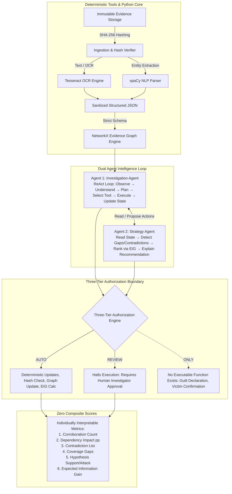

# System Architecture & Invariant Specifications
**Project:** KPYRIOS-ACPIA (Agentic Child Protection Investigation Assistant)  
**Hackathon:** HACKP 2026 — Kerala Police CyberDome  
**Status:** Locked Architecture Specification  

---

## 1. Core Mission & Ethical Boundary

KPYRIOS-ACPIA is an investigator-assistance platform engineered specifically for child-protection digital forensics. 
- **Never Decides Guilt:** The system never issues declarations of guilt, criminal liability, or formal legal culpability.
- **Investigator Sovereignty:** Human investigators retain complete authority and oversight over every consequential operational and legal decision.
- **Explainability Over Black Boxes:** No hidden multi-factor "AI suspicion scores." The platform computes and displays individually decomposed, auditable mathematical quantities.

---

## 2. Locked Two-Agent Architecture

The agentic intelligence layer consists of **exactly two agents**, implemented in a deterministic execution runtime. Everything else is a deterministic engine or tool.

### 2.1 Agent 1: Investigation Agent (ReAct Loop)
- **Lifecycle Loop:** `Observe` → `Understand` → `Plan` → `Select Tool` → `Execute` → `Observe Result` → `Update State` → `Check Objective` → `Replan/Escalate`.
- **Operational Scope:** Responsible for orchestrating evidence processing, triggering extraction tools, querying the graph, requesting deterministic calculations, and maintaining working notes.
- **Constraint:** Does not directly execute consequential actions without passing through the Three-Tier Authorization barrier.

### 2.2 Agent 2: Strategy Agent (EIG & Gap Optimization)
- **Lifecycle Loop:** `Read Graph State` → `Identify Gaps & Contradictions` → `Generate Candidate Actions` → `Compute Expected Information Gain (EIG)` → `Rank Actions` → `Generate Human Explanation`.
- **Operational Scope:** Operates as an analytical advisor to the investigator, calculating which next investigative step (e.g., querying telecommunication logs, requesting ISP records, cross-referencing EXIF coordinates) will maximally reduce uncertainty across competing hypotheses.

### 2.3 Deterministic Engines (Strictly Non-Agentic)
All core forensic operations are pure deterministic Python code:
1. **Hashing & Ingestion:** SHA-256 computation and immutability verification.
2. **OCR & Entity Parsing:** Tesseract OCR and spaCy extraction pipelines returning structured JSON only.
3. **Graph Algorithms:** NetworkX graph math for pathfinding, shortest paths, clustering, centrality, and cycle detection.
4. **Contradiction Detection:** Rule-based temporal, spatial, and relational conflict detectors.
5. **EIG Calculator:** Deterministic Shannon entropy and Bayesian probability delta formulas.

---

## 3. Three-Tier Authorization Model (Enforced in Code)

Authorization is strictly hardcoded into the execution dispatch layer:

| Tier | Name | Allowed Operations | Code Enforcement Mechanism |
|---|---|---|---|
| **Tier 1** | `AUTO` | Evidence ingestion, SHA-256 verification, OCR extraction, NLP parsing, entity deduplication, graph updates, EIG math, gap detection. | Executes automatically without human intervention. Emits structured audit log. |
| **Tier 2** | `REVIEW` | Entity merges, elevating hypothesis status, executing live external database queries, issuing formal summons/warrant drafts, exporting official forensic reports. | **Execution halts immediately.** State machine enters `AWAITING_REVIEW`. An investigator or supervisor must invoke an explicit signed approval endpoint (`POST /api/v1/approvals/:id/approve`) to resume. |
| **Tier 3** | `ONLY` | Declaring guilt, confirming victim identity, legal suspect attribution, issuing criminal charges. | **NO EXECUTABLE FUNCTION EXISTS.** Any request by an agent to perform these actions raises an uncatchable `InviolablePolicyError`. |

---

## 4. Structural Provenance Invariants

Provenance in KPYRIOS-ACPIA is structural, not advisory:
- **Mandatory `source_ids`:** Every `Fact`, `Relationship`, and `Hypothesis` data structure enforces a non-empty `source_ids: list[UUID]` field at schema validation level (Pydantic / SQLAlchemy).
- **Write Rejection:** Any write attempt without valid, verified `source_ids` raises a `ProvenanceIntegrityError` and aborts the transaction.
- **Traceability:** Every node in the UI renders clickable provenance chips tracing back to the immutable SHA-256 evidence record.

---

## 5. Prompt-Injection & Data Security Defenses

- **Data as Data:** Evidence content (e.g., extracted chat transcripts, image EXIF strings, device metadata) is treated purely as untrusted data, never as system instructions.
- **Structured JSON Interface:** Ingestion and OCR tools convert raw strings into validated Pydantic models with strict schemas before being passed to agent reasoning prompts.
- **Bounded LLM Usage:** Claude API is utilized exclusively for bounded textual summarization and narration of deterministic findings; it is never used for graph math, permission verification, or cryptographic hashing.

---

## 6. Decomposed Quantities (Zero Fused Composite Scores)

To maintain absolute judicial clarity and avoid automated bias:
1. **Corroboration Count:** Distinct independent evidence sources supporting a fact.
2. **Dependency Impact (percentage points):** Sensitivity measure showing how much a hypothesis probability drops if a specific piece of evidence is removed.
3. **Contradiction List:** Explicit pairwise contradictions (e.g., timestamp conflict between ISP log and device timestamp).
4. **Coverage Gaps:** Missing investigative vectors (e.g., missing cellular tower logs for a 3-hour window).
5. **Hypothesis Support / Attack Vectors:** Decomposed evidentiary weight for each competing hypothesis ($H_1, H_2, \dots, H_n$).
6. **Expected Information Gain (EIG):** Expected entropy reduction in bits for each proposed investigative action.
